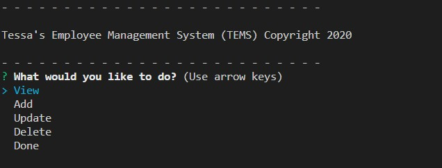

# Employee Tracking Program with Node JS and mySQL

  ## Description
  This program will allow a user to manage the departments, roles, and employees within a company.  They are able to add, delete, update, and delete all aspects of the empoyee management system, as well as view all tables in the database.

  ## Table of Contents

  * [Installation](#installation)
  * [Questions](#questions)
  * [Review](#review)
​

  ## Installation
  The user will need to run npm install to get all needed modules.

  ## Questions
  www.github.com/tesssapierce

  Reach out to me at tesssapierce@gmail.com if you have any questions!

  ### Review

  GitHub URL: https://github.com/tesssapierce/Employee-Tracker-Node-JS-mySQL

  